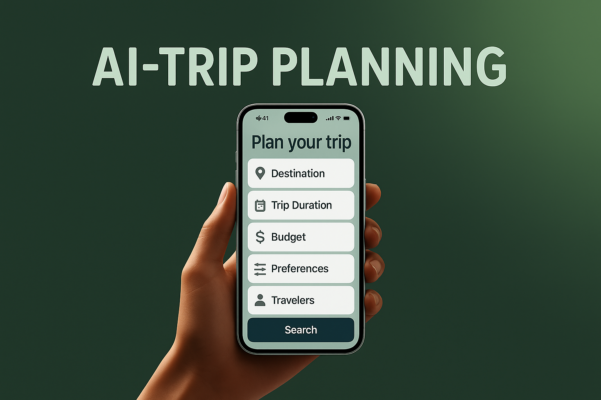
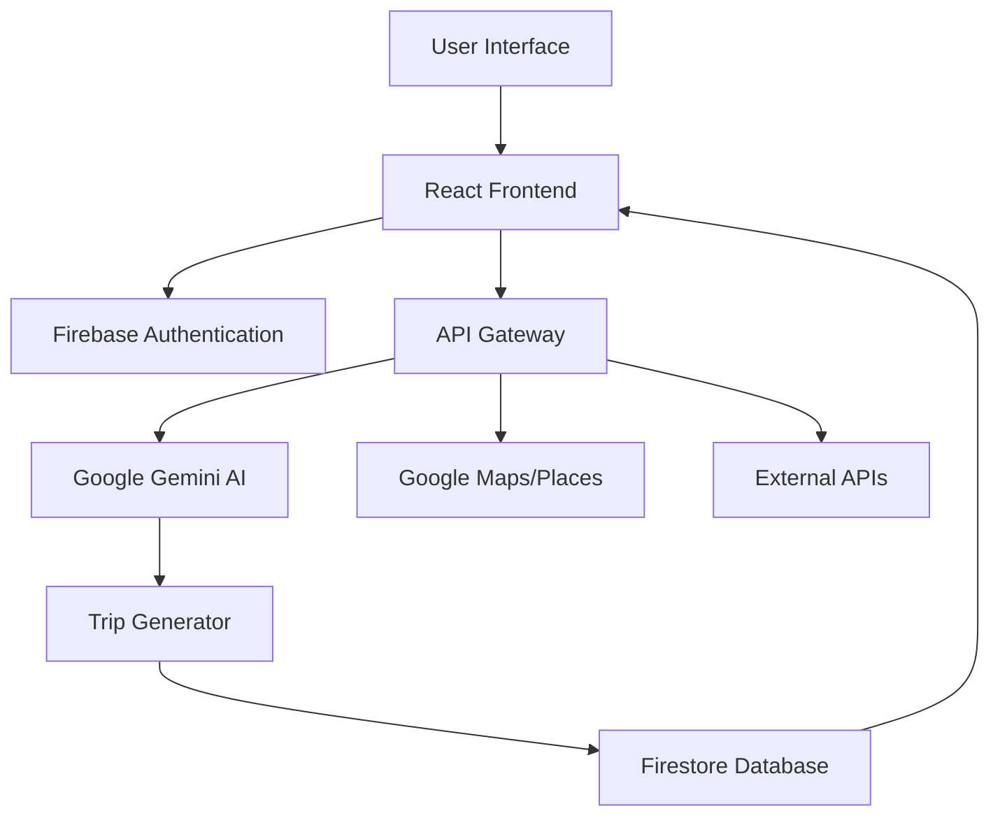
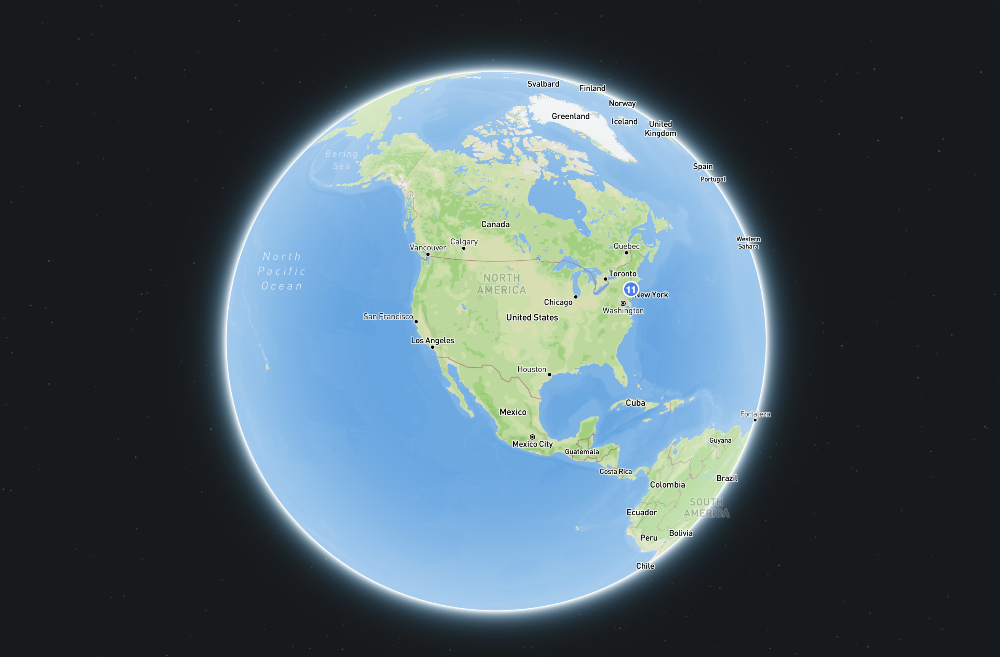
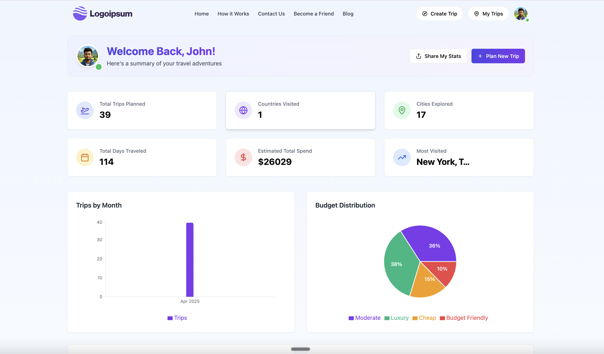

<div align="center">

# ✨ DESTINEX ✨

**Your AI-Powered Travel Companion**

[](https://www.destinex.com)
[](https://github.com/dikondaashish/AI-Powered-Travel-Companion)




*Unlocking extraordinary destinations through artificial intelligence*

</div>

## 🚀 `The Vision`

Destinex reimagines travel planning through the power of AI. Say goodbye to hours spent researching destinations, accommodations, and activities. Our intelligent system crafts personalized itineraries in seconds, adapting to your preferences, budget, and time constraints.

> "Travel is the only thing you buy that makes you richer." – Anonymous

## 🔍 `Key Features`

<table>
  <tr>
    <td width="50%">
      <h3>🧠 AI-Powered Recommendations</h3>
      <p>Our Google Gemini-powered AI analyzes thousands of data points to create your perfect travel plan, considering your unique preferences.</p>
    </td>
    <td width="50%">
      <h3>🌦️ Real-Time Adaptability</h3>
      <p>Dynamic itineraries that adjust to weather changes, local events, and real-world conditions as they happen.</p>
    </td>
  </tr>
  <tr>
    <td width="50%">
      <h3>🔄 Interactive Trip Builder</h3>
      <p>Refine and customize your AI-generated itineraries with an intuitive drag-and-drop interface.</p>
    </td>
    <td width="50%">
      <h3>📊 Smart Travel Insights</h3>
      <p>Visualize your travel patterns, preferences, and spending habits through beautiful, interactive dashboards.</p>
    </td>
  </tr>
  <tr>
    <td width="50%">
      <h3>🗺️ Interactive Maps</h3>
      <p>Explore your destinations with integrated Google Maps showing attractions, restaurants, and points of interest.</p>
    </td>
    <td width="50%">
      <h3>📱 Responsive Design</h3>
      <p>Seamlessly plan trips on any device, from desktop to mobile, with our adaptive interface.</p>
    </td>
  </tr>
</table>

## 🛠️ `Technology Stack`

<div align="center">

### Frontend


### Backend


### AI & APIs


### DevOps


</div>

## 🏗️ `System Architecture`



## 💻 `Quick Start`

```bash
# Clone the repository
git clone https://github.com/dikondaashish/AI-Powered-Travel-Companion

# Navigate to project directory
cd AI-Powered-Travel-Companion

# Install dependencies
npm install

# Set up environment variables
cp .env.example .env
# Edit .env with your API keys

# Start development server
npm run dev
```

Visit `http://localhost:5173` to see your local development version.

## 📱 `User Journey`

<div align="center">
  <table>
    <tr>
      <td align="center"><strong>1. Enter Destination</strong></td>
      <td align="center"><strong>2. Set Preferences</strong></td>
      <td align="center"><strong>3. Get AI Itinerary</strong></td>
    </tr>
    <tr>
      <td></td>
      <td></td>
      <td></td>
    </tr>
  </table>
</div>

## 🧩 `Core Components`

- **Trip Generator Engine**: Processes user inputs through Gemini AI to create personalized itineraries
- **Dynamic Recommendation System**: Adapts suggestions based on user feedback and changing conditions
- **Interactive Map Visualization**: Displays trip details spatially with custom markers and routes
- **User Profile Management**: Stores preferences and learns from past trips to enhance future recommendations
- **Budget Optimization Tool**: Helps users maximize experiences while respecting financial constraints

## 🚀 `Future Roadmap`

- [ ] **Q3 2025**: Enhanced personalization with deep learning models
- [ ] **Q4 2025**: Integration with booking platforms for seamless reservations
- [ ] **Q1 2026**: Mobile app launch with offline capabilities
- [ ] **Q2 2026**: Social features for trip sharing and collaborative planning
- [ ] **Q3 2026**: AR features for on-location guidance and exploration

## 👥 `The Team`

<div align="center">

|  |  |  |  |
|:---:|:---:|:---:|:---:|
| **Dikonda Ashish** | **Rayavarapu Ravi Chandu** | **Emon Tofazzal** | **Venkat Mynapu** |
| Full Stack Developer | AI Specialist | UX/UI Designer | Backend Engineer |

</div>

## 📄 `License`

This project is developed for academic purposes under the Capstone Program at Clark University.

## 🙏 `Acknowledgments`

- Clark University Capstone Advisors for their guidance
- Google Cloud and Firebase teams for their robust platforms
- The open-source community for countless inspirational libraries
- All beta testers who provided valuable feedback

<div align="center">

---

<h3>Try Destinex today and revolutionize your travel planning!</h3>

[](https://destinex.com)
[](https://github.com/dikondaashish/AI-Powered-Travel-Companion)

</div>
